# Market Dashboard

A real-time stock portfolio tracker built with Streamlit. Add positions across major global exchanges, monitor performance in your home currency, and visualise portfolio allocation, price history, and risk.

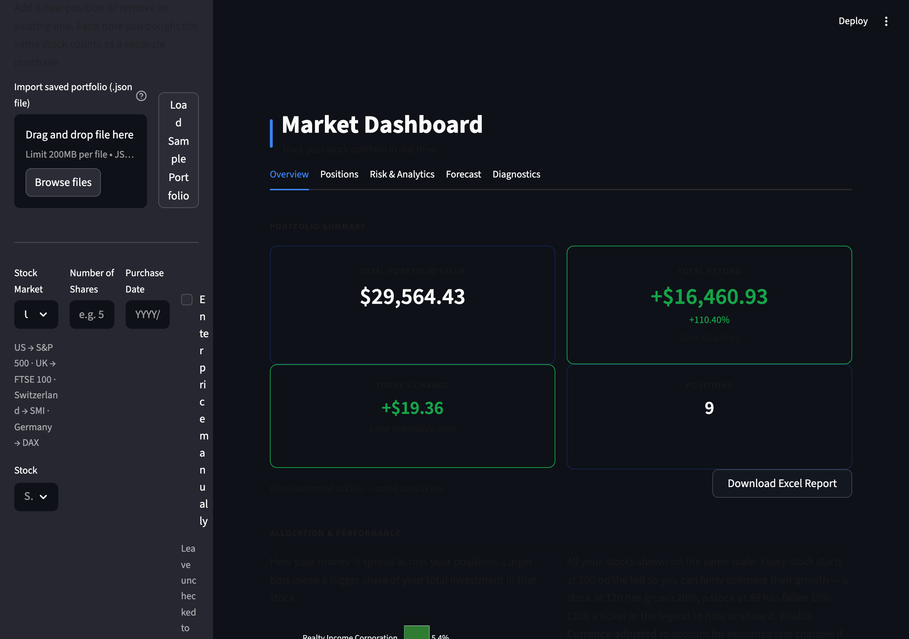

[](https://market-dashboard-open-source-project.streamlit.app)
[](https://www.gnu.org/licenses/agpl-3.0)

## Features

### Portfolio tracking

Add positions across multiple lots per ticker. Live FX conversion across USD, EUR, GBP, and CHF. KPI cards show total value, today's change, total return, and position count at a glance.

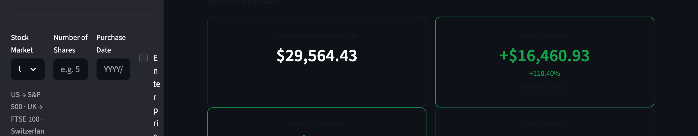

Colour-coded positions table with current price, total value, dividends, daily change, return %, and portfolio weight. Dividends are fetched per lot from the purchase date with historical FX conversion.

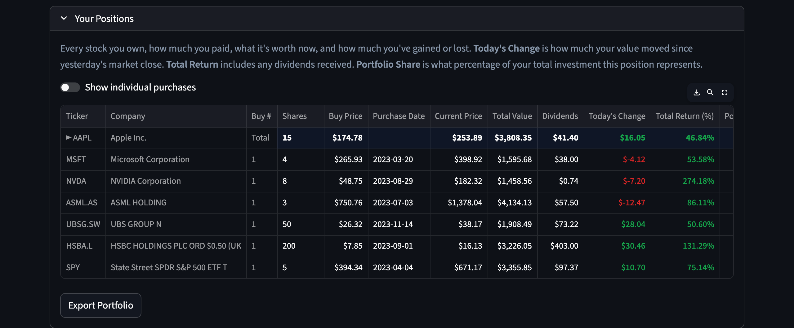

### Charts

Portfolio allocation bar chart sorted by weight, with brand colours for known tickers.

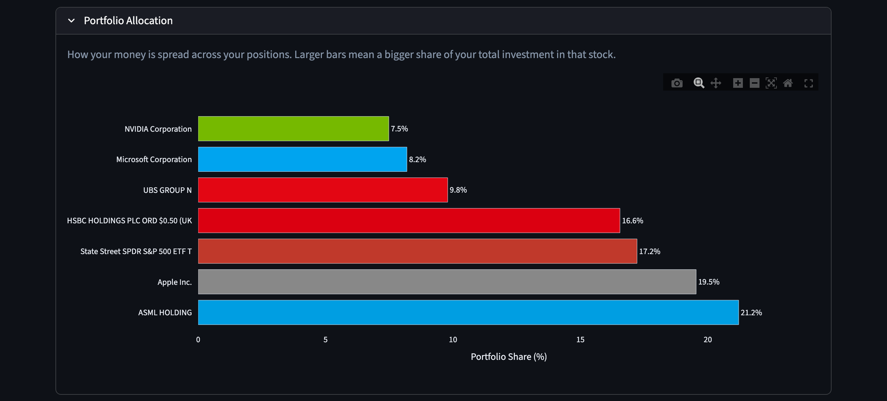

All positions rebased to 100 for fair comparison. Configurable time range (3M / 6M / 1Y / Since first purchase). Toggle currency-adjusted mode. Click legend items to show/hide individual stocks.

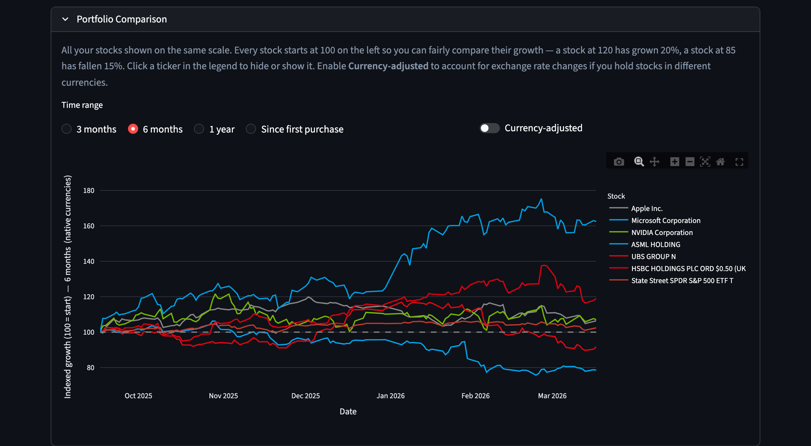

Per-ticker price history with buy price overlays (orange dashed) and purchase date markers (grey dashed) for each lot. Configurable date range with presets (3M / 6M / 1Y / 2Y / Since purchase) or custom from/to dates.

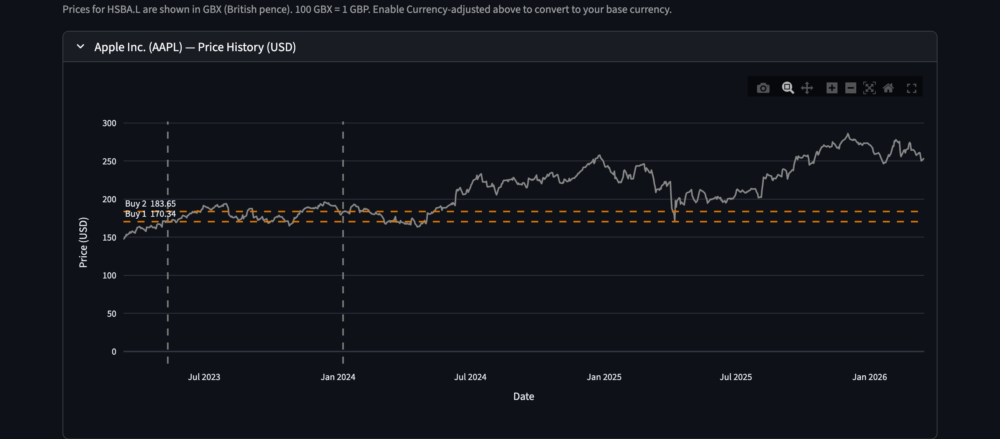

### Risk & Analytics

Per-ticker volatility, max drawdown, Sharpe ratio, and beta vs S&P 500. Pairwise correlation heatmap. P/E ratio, dividend yield, and 52-week range.

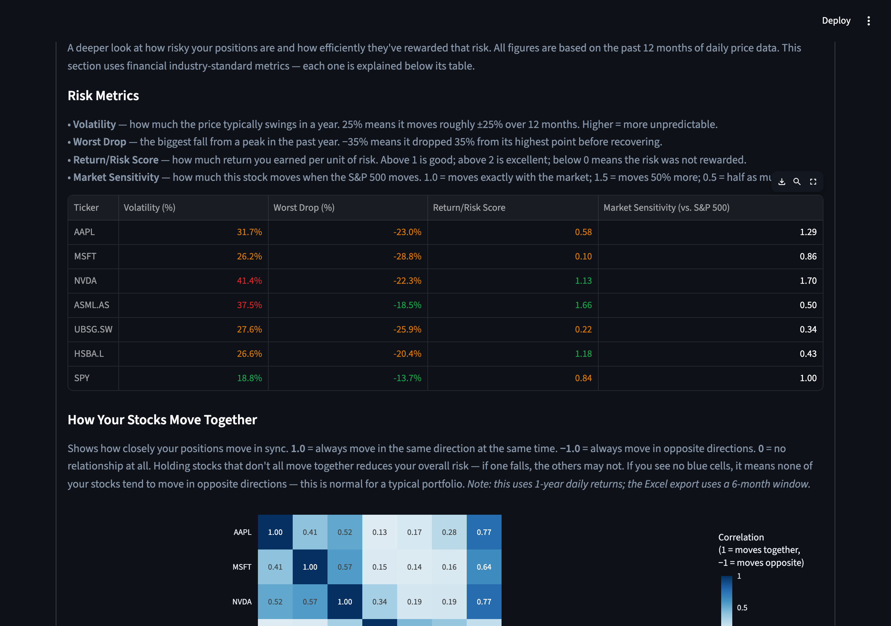

### Monte Carlo

**Portfolio Outlook** — projects your full portfolio forward using correlated Monte Carlo simulation. Fan chart with 50%/80% confidence bands, VaR 95%, CVaR 95% (Expected Shortfall), diversification effect, and outcome distribution histogram.

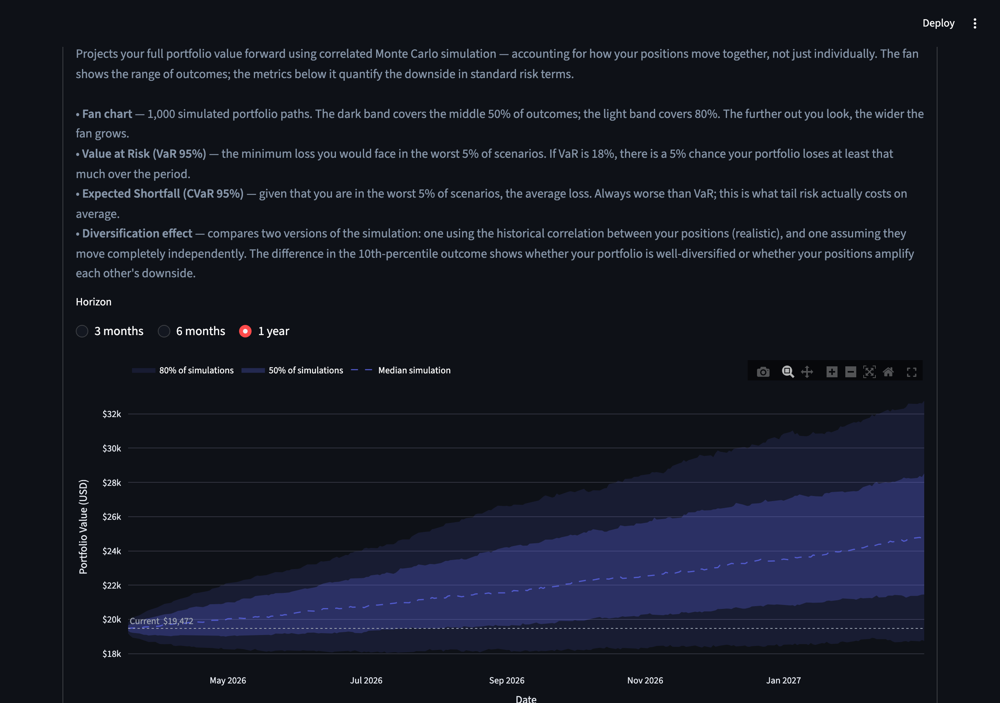

**Position Outlook** — per-ticker forward projection with configurable horizon (3M / 6M / 1Y) and calibration window (1Y / 2Y / 5Y). Buy price overlays and probability of breakeven.

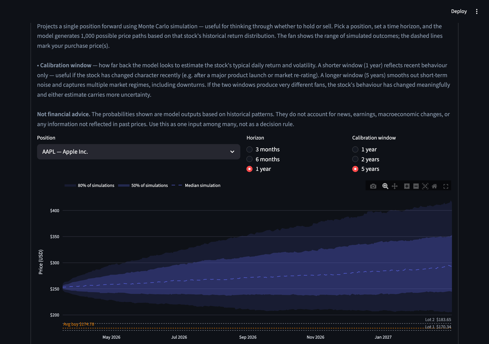

**Backtest** — validates the simulation model against the past year of actual prices. Reports per-ticker hit rates, excess kurtosis, and reliability labels so you know which positions the model fits well.

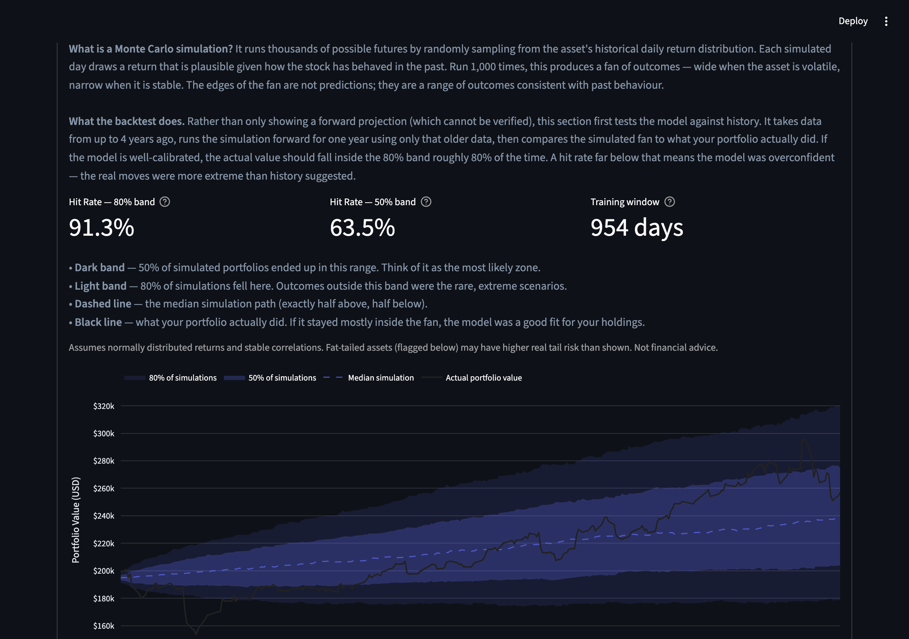

**Model Diagnostics** — tests the two core assumptions behind the simulation: normality (Jarque-Bera test) and independence (Ljung-Box test) of daily returns. Per-ticker summary table with pass/fail verdicts and QQ plots for visual inspection of tail behaviour.

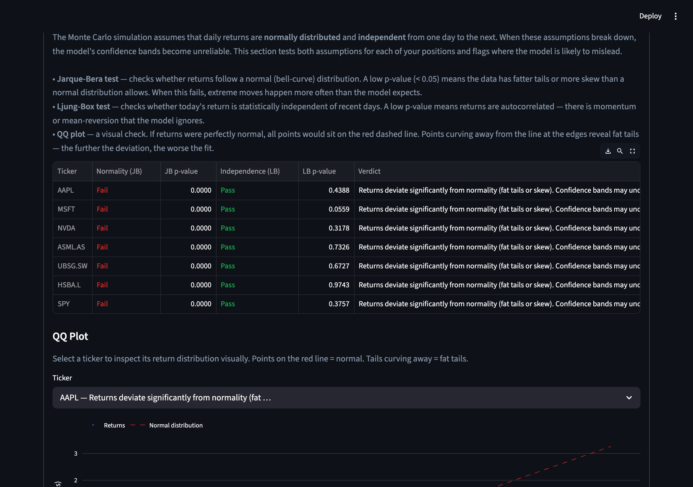

### Other

- **Global stock coverage** — S&P 500, FTSE 100, DAX, CAC 40, SMI, AEX, IBEX 35, ETFs, crypto, commodities, REITs, bonds, and emerging markets; searchable via index-filtered dropdown
- **Excel report export** — download a formatted multi-sheet `.xlsx` report with embedded charts, live formulas, and a pre-built template for manually adding other assets (real estate, private equity, etc.) to calculate total net worth
- **Import / export** — save and load your portfolio as JSON, with validated parsing on import
- **Performance** — all price data and stock lists are cached; price history charts lazy-load on demand

## Setup

1. Clone the repository
```
git clone https://github.com/joakim-hersche/market-dashboard.git
cd market-dashboard
```

2. Install dependencies
```
pip install -r requirements.txt
```

3. Run the app
```
streamlit run app.py
```

## Project Structure

```
market-dashboard/
├── app.py                       # Streamlit application
├── src/
│   ├── portfolio.py             # Portfolio construction and P&L calculations
│   ├── monte_carlo.py           # Monte Carlo simulation and backtest
│   ├── stocks.py                # Stock list fetching (Wikipedia scraper)
│   ├── fx.py                    # FX rate fetching and currency detection
│   ├── excel_export.py          # Multi-sheet Excel report generation
│   └── localstorage_component.py  # Browser local storage persistence
├── data/
│   └── sample_portfolio.json
├── Screenshots/
├── requirements.txt
└── README.md
```

## Tech Stack

- Python 3.12
- [Streamlit](https://streamlit.io) — web UI
- [yfinance](https://github.com/ranaroussi/yfinance) — real-time stock, FX, and dividend data
- [pandas](https://pandas.pydata.org) / [NumPy](https://numpy.org) — data processing
- [Plotly](https://plotly.com/python/) — interactive charts
- [openpyxl](https://openpyxl.readthedocs.io) — Excel report generation

## Disclaimer

The Monte Carlo simulation and all probability figures in this dashboard are statistical outputs based on historical return distributions. They do not constitute financial advice, and they do not account for future events, news, earnings, or macroeconomic changes not reflected in past prices. Positions flagged as fat-tailed (high excess kurtosis) violate the model's normality assumption — confidence bands for those assets will understate real tail risk. Use this tool as one analytical input among many.

## Technical Notes

- **GBX/GBP handling** — London Stock Exchange tickers (`.L`) are quoted in pence by yfinance. All `.L` prices are divided by 100 before P&L or FX calculations to correct for this.
- **Dividend adjustment** — dividends are fetched per lot from the purchase date using `yfinance.Ticker.history()`. Historical FX rates are applied at each ex-dividend date so cross-currency income positions are converted accurately, not at today's rate.
- **Tiered caching** — three `@st.cache_data` TTLs: 15 minutes for current quotes, 24 hours for full price history and stock lists, and 24 hours for fundamentals and Monte Carlo simulation data.
- **Multi-lot support** — each ticker can hold multiple lots with independent purchase dates and prices. The comparison chart groups by ticker using the earliest lot's start date.
- **Error handling** — all yfinance calls are wrapped in try/except with graceful `st.warning` fallbacks, so a single failed ticker doesn't crash the dashboard.
- **Monte Carlo** — simulations use log-normally distributed daily returns calibrated from up to 5 years of historical data. Correlated multi-ticker paths are generated via Cholesky decomposition of the historical covariance matrix. Per-ticker reliability is validated by backtesting the model against the past year of actual prices. Tickers with insufficient history (< 2 years) are excluded from the backtest automatically.
